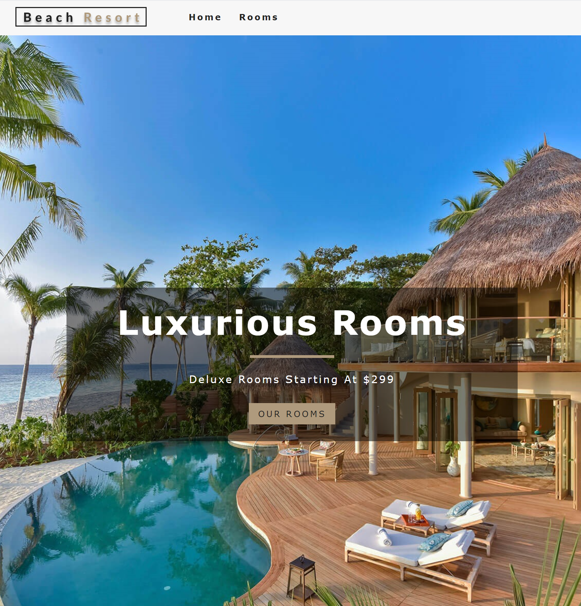
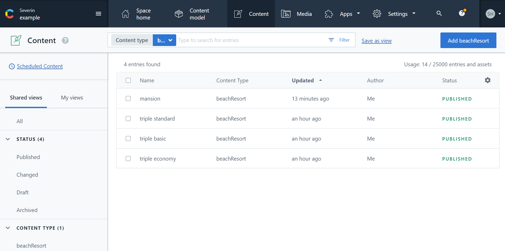
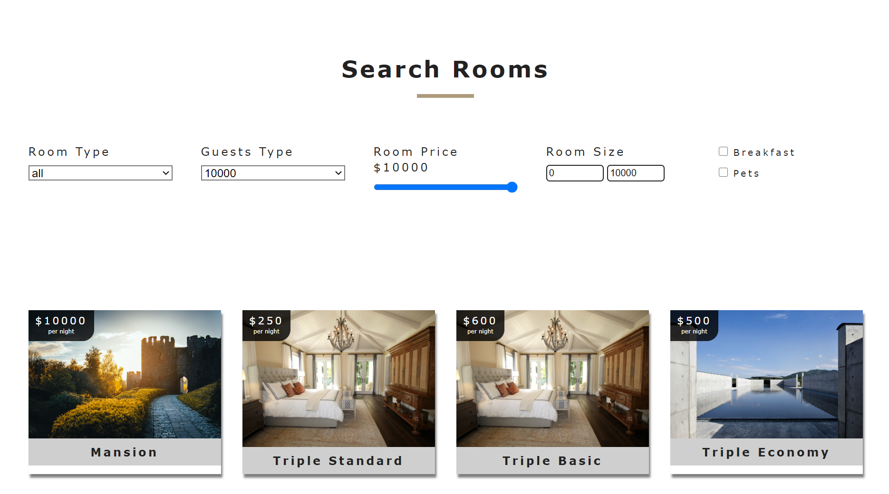

# React,Contentful and Netlify hotel reservation site tutorial

https://www.youtube.com/watch?v=LXJOvkVYQqA&list=WL&index=184

### Finished site on Netlify: 
https://react-beach-resor-application.netlify.app/

To run local:
make sure to install all relevant packages mentioned in tutorial (react, contentful etc.).

run npm start and visit http://localhost:3000/ 

### Screenshot of landing page

### Screenshot of Contentful content overview

### Screenshot of content from Contentful in finished project 
